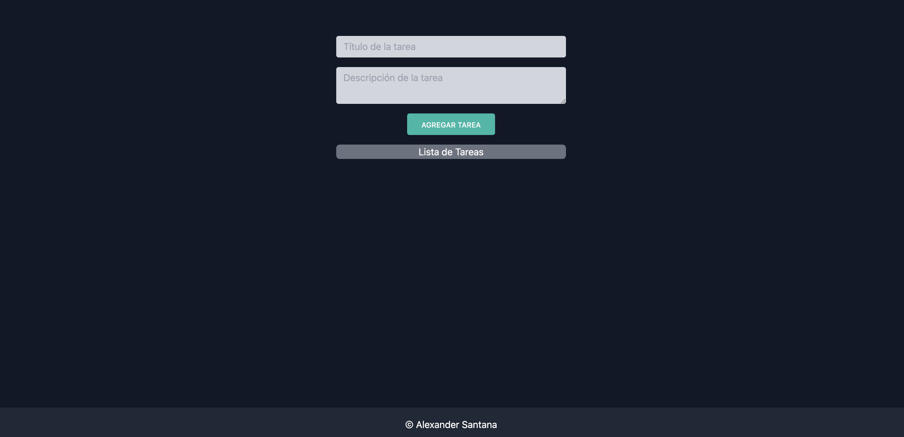

<h1 align="left">Lista Tareas</h1>

-   Para ejecutar la primera parte del script hecho con php y javascript (JQuery):
    -   en el fichero script.js en las rutas usasdas "/proyectos/lista-tareas/api.php", remplazar 'proyectos' por la ruta donde
        tengas tu servidor local apache 'TU-RUTA-SERVIDOR-LOCAL'

# react-app-tareas

-   Para ejecutar la aplicación de react:
    -   Instalar dependencias de node-modules: 'pnpm install'
    -   Ubicarte en la ruta con: 'cd react-app-tareas'
    -   Arrancar proyecto: 'pnpm run dev'

###

    

###

<h2 align="left">Hecha con</h2>

###

    
    
    
    
    
    
    
    

###

<h2 align="left">URL de la web: https://lista-tareas-three-pi.vercel.app/ </h2>

###
